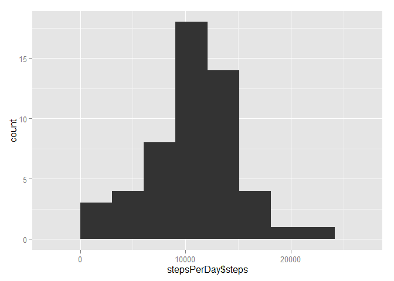
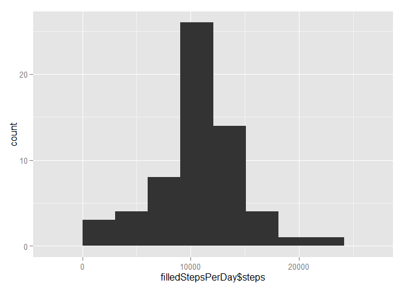

# Reproducible Research: Peer Assessment 1


## Loading and preprocessing the data

Loading required libraries and reading .csv data from local workspace

```r
library(plyr)
library(ggplot2)
library(lattice)
data <- read.csv("activity.csv")
```


## What is mean total number of steps taken per day?

```r
## Part 1 - Histogram
newdata <- data[,c(1,2)]            
stepsPerDay <- na.omit(newdata)         
stepsPerDay <- ddply(newdata, "date", numcolwise(sum))      
ggplot(data=stepsPerDay, aes(stepsPerDay$steps)) + geom_histogram(binwidth=3021.857)        
```

 

```r
meanValue <- mean(stepsPerDay$steps, na.rm=TRUE)    
meanValue
```

```
## [1] 10766.19
```

```r
medianValue <- median(stepsPerDay$steps, na.rm=TRUE)        
medianValue
```

```
## [1] 10765
```


## What is the average daily activity pattern?

```r
## Part 2 - Time Series Plot
newdata2 <- data[,c(3,1)]
newdata2 <- aggregate(.~interval, data=newdata2, mean)
ggplot(data=newdata2, aes(interval, steps)) + geom_line()
```

 

```r
maxValue = max(newdata2$steps)
rowMax <- which(grepl(maxValue, newdata2$steps))
newdata2[rowMax,]
```

```
##     interval    steps
## 104      835 206.1698
```


## Imputing missing values

```r
 ## Part 3 - Replacing Missing Values
newdata3 <- data
length(which(is.na(newdata3$steps)))
```

```
## [1] 2304
```

```r
   # Calculate means of the intervals
meanIntervals <- newdata2
filledData <- mutate(newdata3, steps=replace(steps, is.na(steps), meanIntervals$steps))
    
# Remove interval column
filledStepsPerDay <- filledData[,c(2,1)]
filledStepsPerDay <- ddply(filledStepsPerDay, "date", numcolwise(sum))
ggplot(data=filledStepsPerDay, aes(filledStepsPerDay$steps)) + geom_histogram(binwidth=3021.857)
```

 

```r
meanValue2 <- mean(filledStepsPerDay$steps)
meanValue2
```

```
## [1] 10766.19
```

```r
medianValue2 <- median(filledStepsPerDay$steps)
medianValue2
```

```
## [1] 10766.19
```


## Are there differences in activity patterns between weekdays and weekends?

```r
## Part 4 - Weekdays and Weekends
filledData$date <- as.Date(filledData$date)
weekDays <- c("Monday", "Tuesday", "Wednesday", "Thursday", "Friday")
filledData$dayType <- factor((weekdays(filledData$date) %in% weekDays), levels=c(FALSE, TRUE), labels=c("weekend", "weekday"))
    
# Create multipanel plot
filledData <- filledData[, c(1,3,4)]                               
weekData <- split(filledData, filledData$dayType)                   
weekEndData <- aggregate(.~interval, data=weekData$weekend, mean)   # Calculate means seperately for weekend
weekDayData <- aggregate(.~interval, data=weekData$weekday, mean)   # Calculate means sepeartely for weekday
weekEndData$dayType <- "weekend"
weekDayData$dayType <- "weekday"
weekData <- rbind(weekEndData, weekDayData)                         # Merge back the data into one to produce graph
xyplot(steps~interval | dayType, data=weekData, type="l", xlab="Interval", ylab="Number of steps", layout=c(1,2))
```

 
